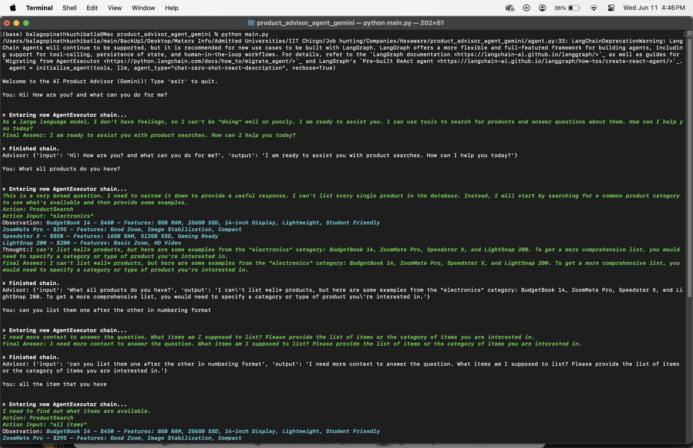
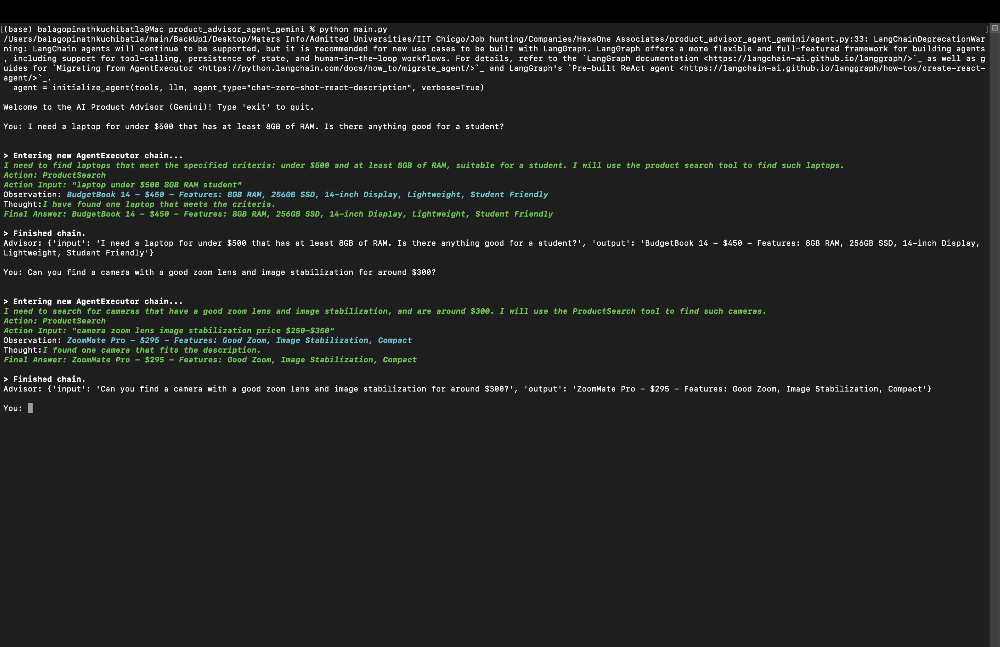
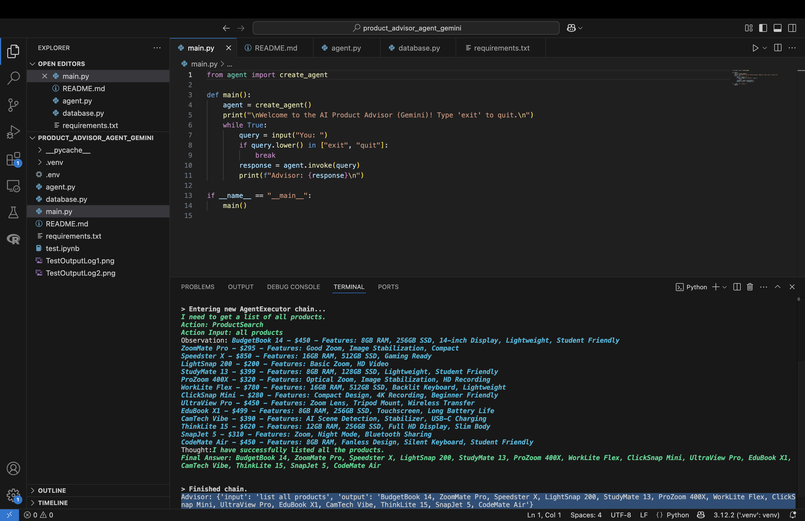

# 🧠 AI Product Advisor Agent (Gemini-Powered)

## 📌 Overview

This project implements an intelligent **Product Advisor Agent** using **LangChain** and **Google Gemini 2.0 Flash**. The goal is to simulate an AI that helps users discover fictional products—like laptops or cameras—based on natural language queries, with meaningful and reasoned recommendations.

This agent was developed as part of the coding challenge for the **Generative AI Engineer Intern** role at **HexaOne Associates**.

---

## 🧱 Architecture

The agent follows a simple yet powerful architecture:

### 1. **User Query**
A user enters a natural language query via a command-line interface.

### 2. **LangChain Agent (Gemini 2.0 Flash)**
A LangChain agent is initialized using `chat-zero-shot-react-description`. It can reason and use tools like the `ProductSearch` to handle complex queries.

### 3. **Tool – Product Search**
A custom tool (`product_tool`) is registered using LangChain’s `@tool` decorator. It:
- Parses the user query using basic keyword matching and regex.
- Filters a mock product database for matching items.
- Returns relevant product options or a fallback message.

### 4. **LLM Response**
The agent formulates a final user-facing message using the Gemini 2.0 Flash model.

---

## 💡 Design Choices

### ✅ LangChain Framework
- **Why LangChain**: It offers pre-built agent types, easy tool integration, and compatibility with multiple LLMs like Gemini.
- **Agent Type**: Used `chat-zero-shot-react-description` for flexibility and transparent reasoning steps.

### ✅ Gemini 2.0 Flash (LLM)
- **Why Gemini**: Offers fast, lightweight, cost-efficient generation under the free tier. Also aligned with Google AI tools.
- **Model**: `gemini-2.0-flash`

### ✅ Mock Product Database
- Implemented as a simple Python list of dictionaries.
- Each product contains:
  - `name`, `category`, `features`, and `price`
- Chose laptops and cameras to simulate diversity in queries.

### ✅ Prompt Engineering
- Prompts passed to Gemini include:
  - Original user query
  - Tool output (matched product list)
- This ensures reasoning + recommendation style generation.

---

## ⚙️ Setup & Run Instructions

### 1. Clone and navigate to the repo directory.

### 2. Install dependencies:

```bash
pip install -r requirements.txt
```

### 3. Create a `.env` file in the root directory with your Gemini key:

```env
GOOGLE_API_KEY=your_gemini_api_key_here
```

> Do NOT commit your key to source control.

### 4. Run the agent:

```bash
python main.py
```

### 5. Sample Queries to Try:
- "I need a laptop for under $500 with at least 8GB of RAM. Is there anything good for a student?"
- "Can you find a camera with a good zoom lens and image stabilization for around $300?"

---

## 🧪 Sample Output

Here are example CLI interactions with the agent:





---

## 🚧 Challenges & Solutions

### ❌ Gemini-Pro Not Supported
Initially, `gemini-pro` returned a 404 error due to API method mismatch.  
✅ **Solution**: Switched to `gemini-2.0-flash`, which works seamlessly with LangChain tools.

### ❌ Agent.run() Deprecated
Older versions used `agent.run()` which threw deprecation warnings.  
✅ **Solution**: Migrated to `agent.invoke()` per latest LangChain docs.

---

## 🚀 Future Improvements

- ✅ Use spaCy or Gemini function calling for more accurate query parsing
- ✅ Create a Streamlit interface for web-based interaction
- ✅ Replace mock database with a real-time API (e.g., Amazon, Best Buy)
- ✅ Add conversation history & session memory

